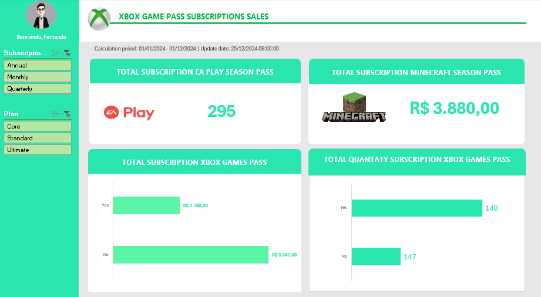

# Projeto Dashboard Xbox 

Projeto de um Dashboard Xbox sobre as vendas de assinaturas dos jogos no ano de 2024, onde foi utilizada a base da tabela que contem todos os dados brutos em informações.

Foram utilizados filtros, gráficos,  ícones, logo e paleta de cores com foco na organização e na visualização dos dados.

Os cálculos, filtros e gráficos foram feitos com tabelas dinâmicas do Excel para responder perguntas pertinentes ao negócio da empresa e serem apresentaadas à liderança para tomada de decisões.

Também foi colocado o período calculado com a data e horário do Update atual. 

